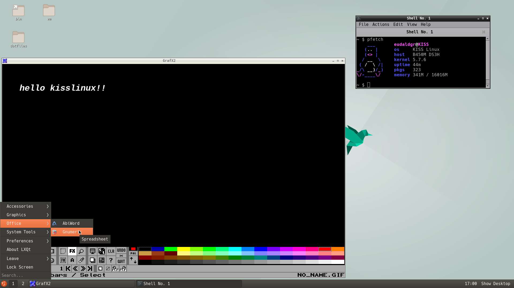

# kiss-lxqt
:construction: This repository is in a early stage.

- [ ] lxqt



## Dependencies
- [x] breeze-icons (via [kiss-kde](https://github.com/dilyn-corner/KISS-kde) repo)
- [x] elogind (via [kiss-kde](https://github.com/dilyn-corner/KISS-kde) repo)
- [x] lximage-qt
- [x] lxmenu-data
- [x] lxqt-about
- [x] lxqt-admin
- [x] lxqt-archiver
- [x] lxqt-config
- [x] lxqt-globalkeys
- [x] lxqt-notificationd
- [x] lxqt-openssh-askpass
- [ ] lxqt-panel
- [x] lxqt-policykit
- [x] lxqt-powermanagement
- [x] lxqt-qtplugin
- [x] lxqt-runner
- [x] lxqt-session
- [x] lxqt-sudo
- [x] lxqt-themes
- [x] obconf-qt
- [x] openbox (via [community](https://github.com/kisslinux/community) repo)
- [x] pcmanfm-qt
- [x] qterminal
- [ ] upower
- [ ] xdg-utils

## Install
In order to build `lxqt`, we need to add some other repositories.
```
$ git clone https://github.com/kisslinux/community
$ git clone https://github.com/sdsddsd1/mywayland
$ git clone https://github.com/dilyn-corner/KISS-kde
$ git clone https://github.com/eudaldgr/kiss-lxqt

$ export KISS_PATH=/path/to/kiss-lxqt/kiss-lxqt:$KISS_PATH
$ export KISS_PATH=/path/to/KISS-kde/KISS-kde:$KISS_PATH
$ export KISS_PATH=/path/to/mywayland/wayland:$KISS_PATH
$ export KISS_PATH=/path/to/community/community:$KISS_PATH
```
